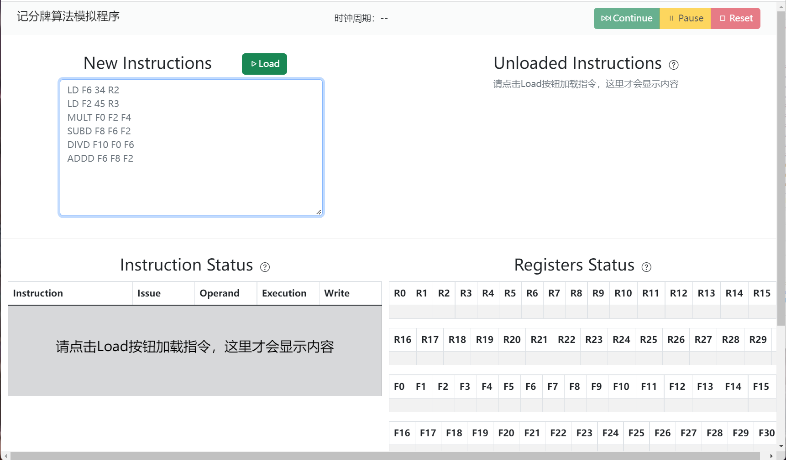
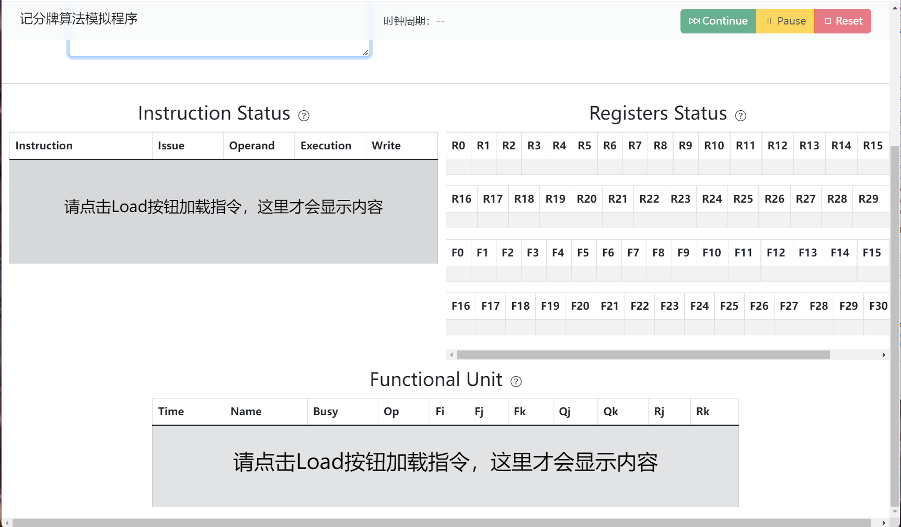
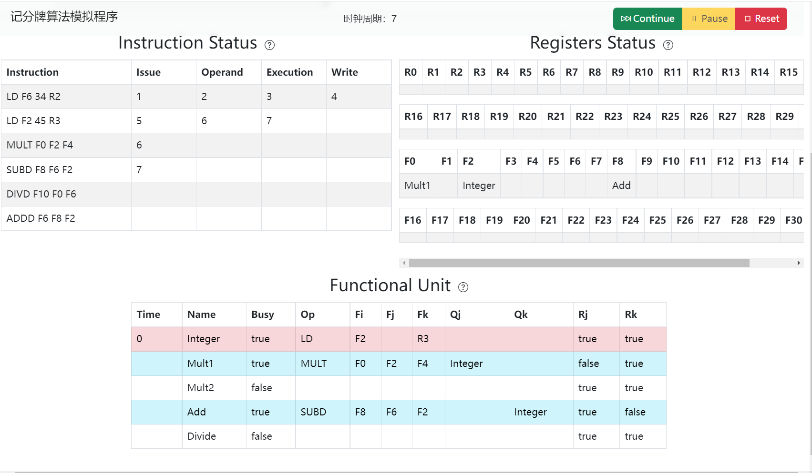
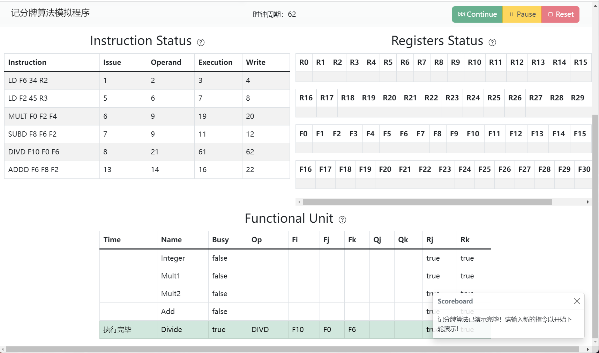

# 记分牌算法可视化演示
<div style="text-align:center;margin:auto;width:400px;">
<table>
<tr>
<td></td>
<td></td>
</tr>
<tr>
<td>起始界面1</td>
<td>起始界面2</td>
</tr>
<tr>
<td></td>
<td></td>
</tr>
<tr>
<td>运行过程</td>
<td>运行结束</td>
</tr>
</table>
</div>

## 技术栈
* 主要算法结构——JavaScript
* 可视化——Bootstrap 4+HTML+CSS
* 在原先HTML界面的基础上，运用Bootstrap组件增强可视化体验
## 项目结构
* 网页主文件 `index.html`
* 驱动程序 `app.js`
* 基础类实现 `simulate.js`
  * `Instruction` 指令类表示
    ```js
    function Instruction(Op, dest, source_1, source_2) {
      this.Op = Op;  // 操作码
      this.dest = dest;  // 目标寄存器
      this.source_1 = source_1;  // 源寄存器1
      this.source_2 = source_2;  // 源寄存器2
      this.state = 0; // 指令运行状态，0: not run, 1: running, 2: finished
      this.stage = ["", "", "", ""];  // 阶段
      // stage[0]=Issue, stage[1]=Operand, stage[2]=Execute, stage[3]=Write result
    }
    ```
  * `Controller` 控制器类表示
    ```js
    function Controller(instructions){
      this.clock = -1;     // 系统时钟
      this.maxFetchSize = 10;     // 模拟器一次最多执行指令的数量
      this.instructions = instructions;   // 需要执行的指令
      this.fetched = [];  // 已经准备好且可以运行的指令列表
      // 本模拟器中的可用的功能组件
      this.functionUnitSet = {
          "Integer": new FunctionUnit("Integer", 1),
          "Mult1": new FunctionUnit("Mult1", 10),
          "Mult2": new FunctionUnit("Mult2", 10),
          "Add": new FunctionUnit("Add", 2),
          "Divide": new FunctionUnit("Divide", 40)
      };
      // 指令对应的功能组件
      this.opToFunctionUnit = {
          "LD": ["Integer"],
          "MULT": ["Mult1", "Mult2"],
          "SUBD": ["Add"],
          "DIVD": ["Divide"],
          "ADDD": ["Add"]
      }
      // 本模拟器中可用的寄存器
      this.registers = {
          // F0~F31, R0~R31
          // 每个使用 new Register() 初始化
      }
    }
    ```
  * `Register` 寄存器类表示
    ```js
    function Register() {
        this.state = false; // 存储器被占用的状态，false不忙，true忙
        this.manipulation = "";  // 当前操作的寄存器
        this.read = 0; // the instruction which read this register issue time
    }
    ```
## 什么是记分牌算法
记分牌算法是CDC公司提出的一个优秀的乱序执行算法，其特点为顺序发射、乱序执行、乱序提交（执行结束），解决了乱序执行过程中的数据冒险问题。

记分牌的控制过程分为四步：


但是，记分牌算法还是会因为WAR和WAW冒险而产生阻塞，且一旦产生阻塞，后续相同类型的指令就没办法继续发射（在乱序执行过程中，记分牌规定每一条配置路线都只能同时存在一条指令）；而且，指令的完成并不是顺序的，这可能对程序的调试提出挑战。
## PPT案例讲解
> 本段内容参考 https://zhuanlan.zhihu.com/p/496078836
```
LD F6 34 R2
LD F2 45 R3
MULT F0 F2 F4
SUBD F8 F6 F2
DIVD F10 F0 F6
ADDD F6 F8 F2
```
1. 第一个周期，记分牌是空的，功能部件也都是空闲的，因此第一条指令顺利渡过发射阶段，并在周期结束的时候更新了记分牌。注意看更新内容。整数部件现在显示忙碌，而LD指令的操作数不存在冒险，Rk显示Yes，在寄存器状态里标记F6即将被整数部件改写。
2. 第二个周期，因为整数部件被占用了，所以第二条LD指令不能发射。同时第一条LD顺利渡过读数阶段。此时不更新记分牌。
3. 第三个周期，由于INST寄存器只有一个，所以发射阶段是阻塞的、顺序的。因为第二条LD没法发射，后面的指令都没办法发射。
    * 第一条LD顺利渡过执行阶段，并在周期结束时改写了记分牌，这里主要是解放了Rk（从Yes变为No），即表示自己不再要读取寄存器R2。
4. 第四个周期，后续指令依旧没办法发射。第一条LD顺利渡过写回阶段，阶段结束时清空功能状态，并且解放了寄存器状态（应该清除F6下面的Integer，PPT里是错的），即F6已经被写完了，F6不再是“即将被整数部件写”的状态。
5. 第五个周期，整数部件空闲，所以第二条LD终于可以发射了。
    * 在周期结束时，LD改写记分牌，并且改写寄存器状态。
6. 第六个周期，乘法部件有空闲，所以MULT顺利发射；LD要读的寄存器的值都是最新的，所以可以读取。周期结束时，MULT改写记分牌，根据寄存器状态可知，源寄存器F2正要被整数部件改写，所以MULT要读的F2是过时的，因此记分牌中会打上标记，表示MULT指令还不能读F2。
    * 周期结束时，LD指令不会改写记分牌。
7. 第七个周期，加法部件空闲，所以SUBD指令可以发射；MULT因为记分牌告诉它它还不能读取F2，所以卡在部件寄存器中，不能读数；LD指令顺利执行。
    * 周期结束时，SUBD指令改写记分牌，根据寄存器状态可知，源寄存器F2要被整数部件改写，所以不能读，因此记分牌中标记F2。
    * MULT因为卡在部件寄存器中，所以没有任何动作。
    * LD改写记分牌，主要是改写Rk，以表明自己不再需要读寄存器R3。
8. 第八个周期，因为除法部件空闲，所以DIVD可以发射；SUBD和MULT指令因为F2寄存器还没准备好（看第七个周期的记分牌），所以这个周期卡在部件寄存器中；LD顺利写回。
    * 周期结束时，DIVD改写记分牌，根据寄存器状态，源寄存器F0正要被乘法部件1改写，所以记分牌标记F0，表面F0还不能读。
    * SUBD、MULT还没有动作，但是关于这两条指令的记分牌内容出现变化了。
    * LD将数据写回寄存器堆，并且改写功能状态，具体工作是通知各个部件寄存器，F2寄存器已经被改写好了，寄存器堆中的F2现在是最新值，经过LD的通知，SUBD、MULT指令R信息就从No被改为Yes；并且解放寄存器状态，表明F2不再处于“即将被改写”的状态。
9. 第九个周期，因为加法部件被SUBD指令占用，所以ADDD指令没办法发射；而DIVD指令因为要等到乘法部件1的结果，所以也没法读数；而SUBD和MULT两条指令因为上一周期LD写回完毕，所以这个周期可以读取所有它们需要的寄存器值，因此顺利渡过读数阶段。
    * 周期结束时，功能状态和寄存器状态都没有变化。但是注意记分牌Mult1后面的10和Add后面的2，这是在告诉我们从下一周期开始，乘法和加法将要开始各自的计算，其分别需要10个周期、2个周期。
10. 第十个周期，DIVD指令还在等待寄存器的新值；而乘法部件和加法部件完成了各自的第一个计算周期。
    * 周期结束时，MULT和SUBD修改记分牌，把Rj和Rk的内容置为No，表明自己不再需要读取寄存器。记分牌Mult1前面的9和Add前面的1，表示乘法和加法还各自需要9个周期、1个周期才能执行完毕。
    * 以下省略 MULT（Integer组件）和 SUBD（Add组件）的执行过程，该组件不断修改Time值直到为0。
11. 第20个周期，MULT指令执行完毕，MULT的执行结果写回至寄存器F0中，供ADDD指令使用。寄存器状态表中相应地清空了F0，表示F0不再需要由Mult1指令使用。
12. 第21个周期，DIVD指令终于可以取到寄存器F0的值，进入读操作数状态。
13. 第22个周期，ADDD指令完成运算后，将值写回至寄存器F6中，至此，DIVD所需的操作数均可取到，可以开始40个周期的执行。
14. 第62个周期，DIVD指令完成执行，可以将计算结果写回，所有部件执行结束。